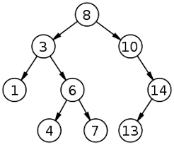

# Tema: Arboles
## Introducción
Los arboles no son nada especial, son otro tipo algebraico recursivo más, la unica diferencía es que tiene más de un elemento recursivo. Nada más.

Lo dificil de los arboles al principio es verles la utilidad.

## Qué solucionan los arboles
Hasta ahora, todas las estructuras que conocemos son lineales, es decir, las operaciones pueden, en el peor de los casos, recorrer todos los elementos de la estructura.

Por ejemplo, buscar el elemento 'x' en una lista de strings que tiene 1 millón de elementos antes del elemento 'x' nos obliga sí o sí a recorrer 1 millón de elementos. En términos generales, no hay mucho que podamos hacer para reducir este tipo de costo; las operaciones siempre van a ser lineales respecto a la cantidad de elementos de la lista

Esto es lo que solucionan los arboles (o cualquier tipo algebraico con más de un elemento recursivo), darnos la posibilidad de reducir los costos de operación gracias a tener una estructura con más DIMENSIÓN. La dimensión es esencial al momento de hablar de árboles porque nos crea la posibilidad de, mediante reglas de ordenamiento, reducir los costos en tiempo de las operaciones.

Pongamos de ejemplo un árbol donde todos los elementos de su rama izquierda son más chicos que su nodo padre, y todos los elementos de la rama derecha son más grandes que su nodo padre.



Si quiero buscar, por ejemplo, el elemento 13, ¿cuántos "pasos" daríamos hasta encontrar el 13?

Supongamos el mismo ejemplo con una lista [8,3,1,6,4,7,10,14,13]. ¿Cuántos "pasos" daríamos hasta encontrar el 13?

Hasta el elemento igual a 13 en la lista daríamos 9 pasos, es decir, recorreríamos toda la lista.

En cambio, en el ejemplo del árbol, si seguimos las reglas antes definidas, sabríamos que 13 es mayor que 8, por lo que buscaríamos en la rama derecha. Luego, veríamos que 13 es mayor que 10, así que continuaríamos en la rama derecha. Después, notaríamos que 13 es menor que 14, por lo que buscaríamos en la rama izquierda. Esto nos daría un total de 3 pasos hasta encontrar el elemento. ¿No es asombroso?


## Recursión sobre arboles (O cualquier tipo algebraico con más de un elemento recursivo)

Todas los tipos algebraicos con N elementos recursivos van a tener por obliación N llamados de la funcion en su definición y el caso base. Puede haber casos donde el resultado de la función no sea una operación entre los N llamados a la función, pero sí van a estar en la definición.

Por ejemplo, esta definicion de dungeon va a tener 2 llamados recursivos en las funciones recusivas
```haskell
data Dungeon a = Sala | Cuarto a (Dungeon a) (Dungeon a)
```

En cambio, esta definicion de dungeon va a tener 6 llamados recursivos en las funciones recusivas
```haskell
data Dungeon a = Sala | Cuarto a (Dungeon a) (Dungeon a) (Dungeon a) (Dungeon a) (Dungeon a) (Dungeon a)
```

Lo importante aca es ENTENDER LA ESTRUCTURA, no importa el dominio, si son árboles, caminos, mapas, o dungeons, las funciones tendrán la misma cantidad de llamadas recursivas que sus elementos recursivos.

Toda función recursiva sobre un tipo algebraico seguirá el siguiente esquema:
```haskell
f caso base = ...
f (S n m d) = n ... f m ... f d
```
En este caso, ¿cuales son los elementos recursivos del tipo algebraico S? 


Más ejemplos: 

```haskell
data Dungeon a = Sala | Cuarto a (Dungeon a) (Dungeon a)
f Sala = ...
f (Cuarto x c1 c2) = x ... f c1 ... f c2
```

```haskell
data Dungeon a = Sala | Cuarto a (Dungeon a) (Dungeon a) (Dungeon a) (Dungeon a) (Dungeon a) (Dungeon a)
f Sala = ...
f (Cuarto x c1 c2 c3 c4 c5 c6) = x ... f c1 ... f c2 ... f c3 ... f c4 ... f c5 ... f c6
```


Algunas funciones pueden requerir tener un esquema como el siguiente:
```haskell
f Sala = ...
f (Cuarto x c1 c2) = if condition 
                     then f c1 
                     else f c2
```

Pero los llamados recursivos SIGUEN ESTANDO.


Aca otro ejemplo más extenso:
```haskell
f Sala = ...
f (Cuarto x c1 c2 c3 c4 c5 c6) = if condition 
                                 then f c1
                                 else if condition 
                                      then  f c2 
                                      else if condition 
                                           then  f c3
                                           else if condition
                                                then f c4
                                                else if condition
                                                     then  f c5
                                                     else  f c6

```
